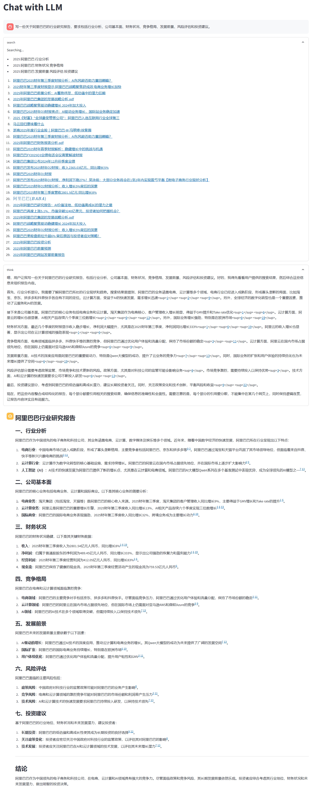

# LLM-With-Web-Search

一个基于 LLM 的智能问答系统，支持网络搜索增强的对话能力。

<div align="center">
  
</div>

## 功能特点

- 🤖 智能判断是否需要搜索
- 🌐 支持多个搜索关键词的并发搜索
- 🔍 智能提取和过滤搜索结果
- 💬 支持上下文对话
- ⚡ 流式输出响应
- 🎯 支持思维链和推理过程展示
- 🔄 支持多种 LLM 模型（OpenAI、DeepSeek等）
- 📱 提供 Web UI 界面

## 安装

1. 克隆项目
```bash
git clone https://gitlab.jinsubao.cn/chenwr/llm-with-web-search.git
cd LLM-With-Web-Search
```

2. 安装依赖
```bash
pip install -r requirements.txt
playwright install chromium
```

3. 配置环境变量
创建 `.env` 文件并配置以下参数：
```plaintext
# llm
ANALYSIS_LLM_API_KEY=your_analysis_llm_api_key
ANALYSIS_LLM_BASE_URL=your_analysis_llm_base_url
ANALYSIS_LLM_MODEL=your_analysis_llm_model
ANALYSIS_LLM_TEMPERATURE=0.6

ANSWER_LLM_API_KEY=your_answer_llm_api_key
ANSWER_LLM_BASE_URL=your_answer_llm_base_url
ANSWER_LLM_MODEL=your_answer_llm_model
ANSWER_LLM_TEMPERATURE=0.6

# search
BOCHA_API_KEY=your_bocha_api_key
BOCHA_NEEDS_CRAWLER=false
BOCHA_NEEDS_FILTER=false

# log
LOG_LEVEL=INFO
```

## 使用方法

### Web UI 界面

运行 Web 应用：
```bash
uvicorn api_server:app --port 8000 --worker uvicorn.workers.UvicornWorker --workers 1
streamlit run web_app.py
```

### 代码调用

```python
from clients.llm import OpenAILLMClient
from clients.search import BingSearchClient
from core.assistant import Assistant
from schemas.chat_message import ChatMessage

async def main():
    # 初始化 LLM 客户端
    analysis_llm = OpenAILLMClient(
        api_key="your_api_key",
        base_url="your_base_url",
        model="your_model"
    )
    answer_llm = OpenAILLMClient(
        api_key="your_api_key",
        base_url="your_base_url",
        model="your_model"
    )
    
    # 初始化搜索客户端
    search_client = BingSearchClient(needs_filter=True)
    
    # 创建助手实例
    assistant = Assistant(analysis_llm, answer_llm, search_client)
    
    # 创建对话消息
    messages = [ChatMessage(role="user", content="塑料7042是什么？")]
    
    # 获取回答
    answer = await assistant.answer_question(messages)
    print(answer)

if __name__ == "__main__":
    import asyncio
    asyncio.run(main())
```

## 项目结构

```
LLM-With-Web-Search/
├── api/                    # 客户端实现
│   ├── dependencies.py     # 依赖注入
│   ├── middleware.py       # 中间件
│   ├── models.py           # 数据模型
│   ├── routers.py          # 路由定义
│   └── services.py         # 业务逻辑实现
├── clients/                # 客户端实现
│   ├── base/               # 基础接口定义
│   ├── llm/                # LLM 客户端实现
│   └── search/             # 搜索客户端实现
├── core/                   # 核心业务逻辑
├── schemas/                # 数据模型定义
├── utils/                  # 工具函数
├── example.py              # 示例代码
├── api_server.py           # API 服务端
└── web_app.py              # Web 应用入口
```

## 主要特性说明

1. 双 LLM 架构
   - Analysis LLM：负责分析问题、提取搜索关键词
   - Answer LLM：负责生成最终回答

2. 智能搜索
   - 自动判断是否需要搜索
   - 支持多关键词并发搜索
   - 智能过滤和提取相关内容

3. 流式输出
   - 支持搜索过程实时展示
   - 支持思维链展示
   - 支持答案流式生成